## Part 1. Установка ОС

* Устанавливаем Ubuntu 20.04 Server LTS без графического интерфейса
* Проверяем версию Ubuntu командой `cat /etc/issue` 
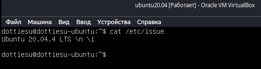

## Part2. Создание пользователя

* Создаем нового пользователя командой `sudo adduser <имя пользователя>` 
 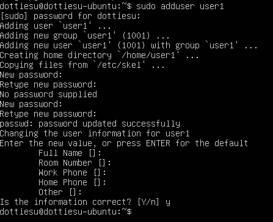
 *Создание нового пользователя* 

* Даем новому пользователю права adm командой `sudo usermod -aG adm <имя пользователя>` 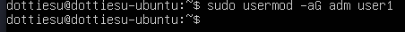
   *Присвоение прав вдминистратора* 
* Проверяем создание нового пользователя командой `cat /etc/passwd`  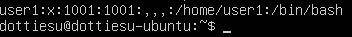 *Проверка нового пользователя* 

## Part 3.  Настройка сети ОС

- Проверяем текущее название машины командой `hostname` 
 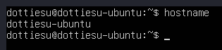 

- Изменяем название машины на user-1 использовав команду `sudo hostname user-1` 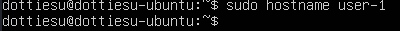
* Далее меняем название машины в файлах hosts и hostname с помощью редактора nano командами `sudo nano /etc/hosts`  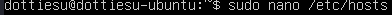
 *Редактируем файл hosts* и `sudo nano /etc/hostname`

* Вызываем перезагрузку системы для сохраниения изменений `sudo reboot` 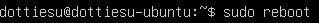 *Перезагружаем систему*

- Проверяем новое название машины командой `cat /etc/hostname` 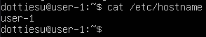

- Вызываем команду `timedatectl` для проверки текущего часового пояса 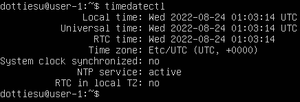				
 *Проверка текущего часового пояса* 

- Задаем необходимый часовой пояс командой `sudo timedatectl set-timezone Europe/Moscow` 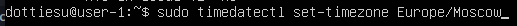

* Проверяем изменения командой `timedatectl` 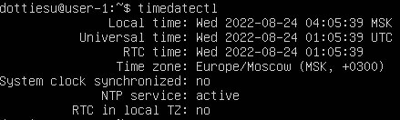 *Проверяем изменения* 

* Выводим названия сетевых интерфейсов командой `ip addr`  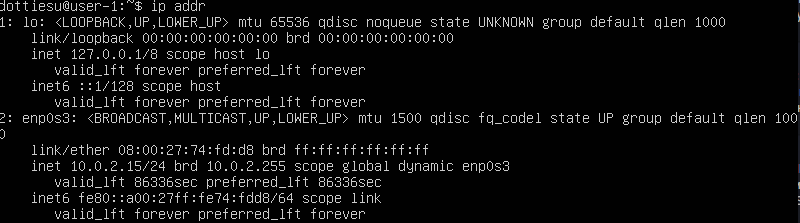 *Названия сетевых интерфейсов* 
- **Loopback** — совокупность методов, нужных для корректной работы маршрутизатора и передачи данных. 

- Сам интерфейс же является отображением логических процессов в маршрутизаторе. Также саму технологию используют и для других целей: 
  1) тестирование передачи данных от обслуживающего центра коммутации; 
  2) проверка сигнала на расстоянии; 
  3) обеспечение работы коммутационных кабелей и их проверка; 
  4) тест обратной петли, когда сигнал посылается и возвращается отправителю по всем коммуникационным каналам. 

- Использовав команду `ip r` узнаем ip-адрес устройства, от DHCP сервера 

  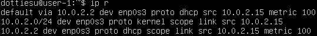  *ip-адрес устройства*

- **Dynamic Host Configuration Protocol (DHCP)** - это протокол управления сетью, используемый в сетях TCP/IP, в котором DHCP-сервер динамически присваивает каждому устройству IP-адрес и другие параметры сетевой конфигурации, чтобы они могли связываться с другими IP-сетями. 

* Выводим внешний и внутренний ip-адреса шлюза командами `curl 2ip.ru` 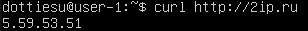 *Внешний ip-адрес*
  и `ip route | grep default` 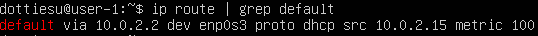 Внутренний ip-адрес

* Задаем статичные настройки ip, gw, dns командой `sudo nano /etc/resolv.conf` 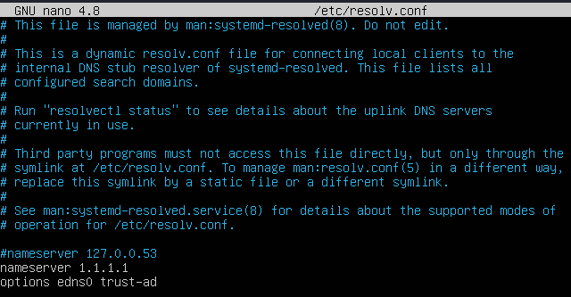 *Редактирование настроек* 
- Перезагружаем виртуальную машину

- Проверяем, что статичные сетевые настройки (ip, gw, dns) соответствуют данным, командой  `ping -c 8 1.1.1.1 && ping -c 8 ya.ru` 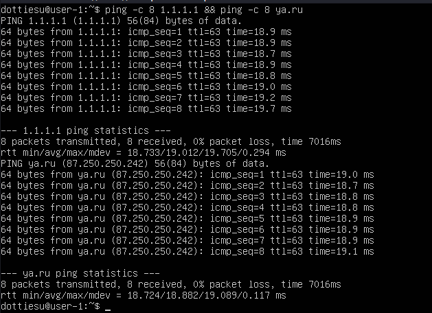

## Part 4. Обновление ОС

* Командой `sudo apt update` узнаём, сколько есть пакетов обновления 
* Обновляем системные пакеты до последней, на момент выполнения задания, версии командой `sudo apt full-upgrade` 
* После обновления системных пакетов, вводим команду обновления повторно, выводится сообщение, что обновления отсутствуют. 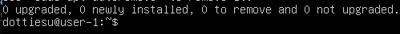

## Part 5. Использование команды sudo

- sudo (англ. Substitute User and do, дословно «подменить пользователя и выполнить») — программа для системного администрирования UNIX-систем, позволяющая делегировать те или иные привилегированные ресурсы пользователям с ведением протокола работы. 
  Даем пользователю, созданному в Part 2, права на выполнение команды sudo `sudo usermod -a -G sudo <имя пользователя>` 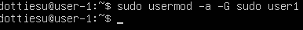 *Присвоение прав вдминистратора* 

- заходим на сервер под другим пользователем `su - <имя пользователя>` 

- Изменяем имя сервера на User-2, командой `sudo hostname User-2`. После ввода пароля проверяем изменения 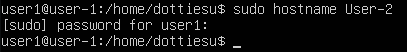 *Изменение имени сервера*

## Part 6. Установка и настройка службы времени

* Выводим текущее время команой `date` 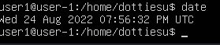 Текущее время

- Активируем NTP командой `sudo timedatectl set-ntp on` 

- Командой `timedatectl show` проверяем подключенную службу синхронизации

  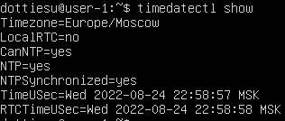 NTPSynchronized активна

## Part 7. Установка и использование текстовых редакторов

- Устанввливаем тестовый редактор MCEDIT командой `sudo apt install mc` 

**Создаем и редактируем файл с сохранением изменений:** **NANO:**

- Создаем файл командой `nano test_nano.txt` и записываем туда свой никнейм 

* Для выхода с сохранением используем команды: `ctrl+x`, `Y`, `Enter` либо `ctrl+o`, `Enter`, `ctrl+x` 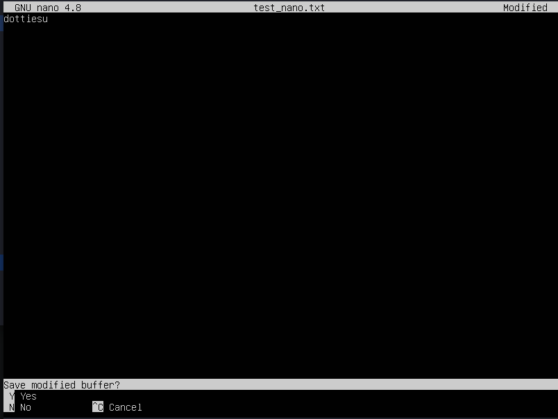 *NANO новый файл*

**VIM:**

* Создаем файл командой `vim test_vim.txt` и записываем туда свой никнейм (для прехода в режим вставки нажимаем `i`)  
* Для выхода с сохранением используем команды: `Esc`, `:wq`, `Enter`  *VIM новый файл*

**MCEDIT:**

* Создаем файл командой `mcedit test_mcedit.txt` и записываем туда свой никнейм 
* Для выхода с сохранением используем команды: `fn+F2`, `Enter`, `fn+F10` 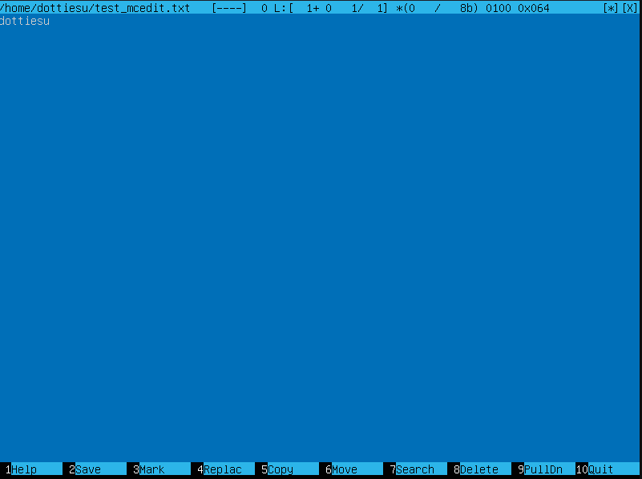

**Редактируем файл без сохранения зменений:** 
**NANO:**

* Открываем файл командой `nano test_nano.txt` и меняем записаный никнейм на "21 School 21" 
* Для выхода без сохраненя используем команды: `ctrl+x`, `n`, `Enter` 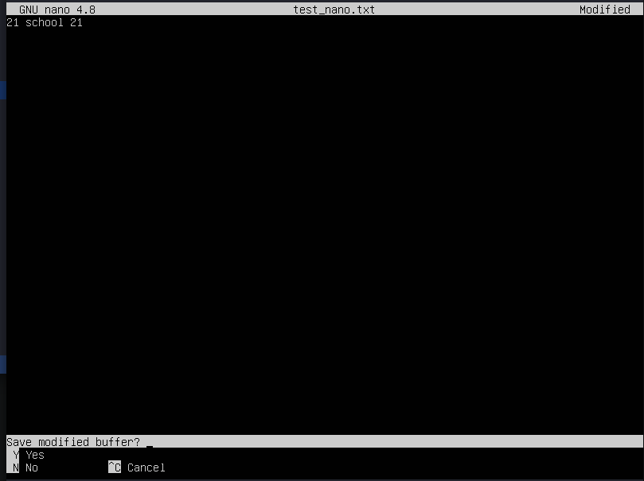 *NANO без сохранения* 

**VIM:**

* Открываем файл командой `vim test_vim.txt` и меняем записаный никнейм на "21 School 21" (для прехода в режим вставки нажимаем `i`)  
* Для выхода без сохранения используем команды: `Esc`, `:q!`, `Enter`  VIM без сохранения

**MCEDIT:**

* Открываем файл командой `mcedit test_mcedit.txt` и меняем записаный никнейм на "21 School 21" 
* Для выхода без сохранения используем команды: `fn+F10`, `No`, `Enter` 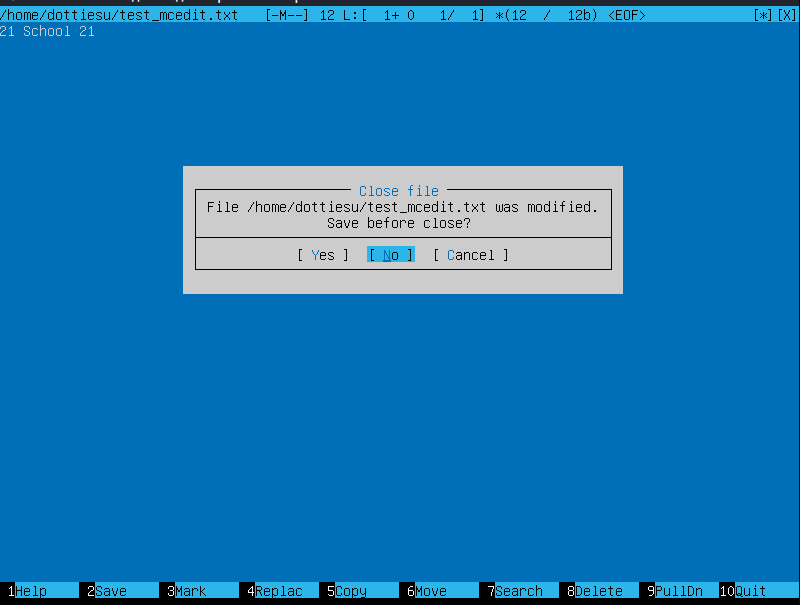 MCEDIT без сохранения

**Редактируем файл с поиском и заменой слова:** 
**NANO:**

* Открываем файл командой `nano test_nano.txt` 
* Для поиска в NANO используем комбинацию `ctrl+W` 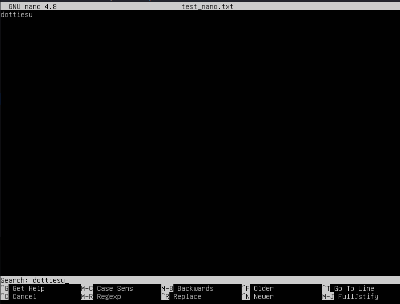 NANO поиск слова
* Для замены слова в NANO вводим `ctrl+\`, пишем слово для поиска, нажимаем `Enter`, пишем слово для замены, нажимаем `Enter`, выбираем `Y` 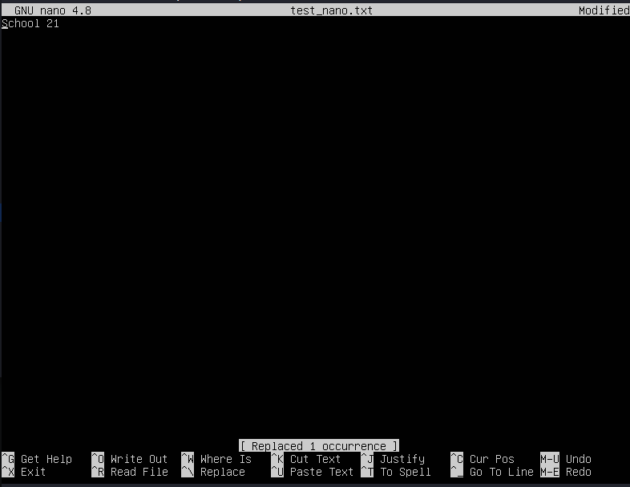

**VIM:**

* Открываем файл командой `vim test_vim.txt` 
* Для поиска в VIM пишем команду `/<слово для поиска>`  *VIM поиск слова*

- Для замены слова в VIM вводим используем команду `:%s/<заменяемое слово>/<новое слово>` 

**MCEDIT:**

* Открываем файл командой `mcedit test_mcedit.txt` 
* Для поиска в MCEDIT используем комбинацию `fn+F7` вводим нужное слово или строку и нажимаем   `Enter` 

- Для замены слова в MCEDIT используем комбинацию `fn+F4` в первом поле пишем заменяемое слово, во втором поле пишем новое слово, нажимаем `Enter` и выбираем `Заменить` 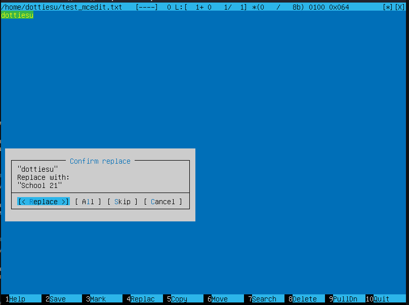

## Part 8. Установка и базовая настройка сервиса SSHD

* Командой `sudo apt install openssh-server` устанавливаем службу SSHd 
* Подключаем автостарт службы `sudo update-rc.d ssh defaults` 
* Для настройки порта открываем текстовый редактор `sudo nano /etc/ssh/sshd_config` и добавляем строку "Port 2022" 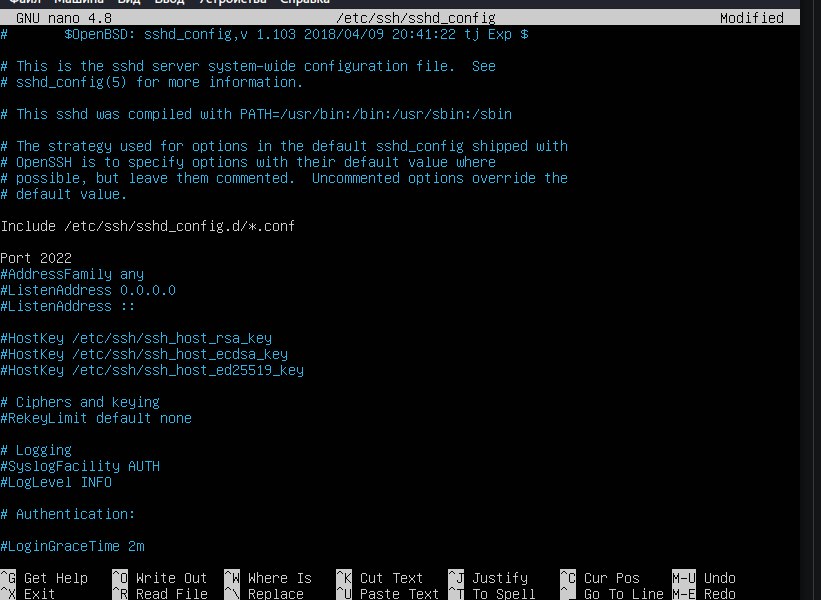
  

- Перезапускаем сервер SSH для применения изменений `/etc/init.d/ssh restart` 

- Используя команду `ps -axfv | grep sshd` проверяем наличие процесса SSHd 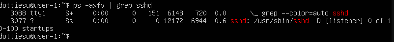
- Команда `ps` выводит список текущих процессов на вашем сервере. Используется обычно в сочетании с командой `grep` 

* Флаги: 
  -a: Выбирает все процессы, кроме лидеров сеансов и процессов, не связанных с терминалом. 
  -x: Заставляет `ps` отображать список всех процессов, которыми вы владеете (тот же EUID, что и у `ps`), или перечислять все процессы при использовании вместе с опцией a 
  -f: Выводит полноформатный список 
  -v: Выводит информацию о версии 

* Комндой `sudo apt install net-tools` устанавливаем "net-tools" после чего выполняем команду `netstat -tan` 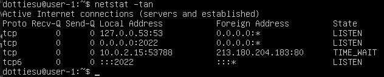

* Опция **-a** показывает состояние всех сокетов; **-n** показывает ip адрес, а не сетевое имя; **-t** показывает только tcp соединения. 
* Значения столбцов: 
  1) Proto - протокол, используемый сокетом; 
  2) Recv-Q - количество байтов, не скопированных пользовательской программой, подключенной к этому сокету; 
  3) Local Address - локальный адрес (имя локального хоста) и номер порта сокета; 
  4) Foreign Address - удаленный адрес (имя удаленного хоста) и номер порта сокета; 
  5) State - состояние сокета; 
  6) 0.0.0.0 в этом контексте означает "все IP-адреса на локальной машине". 

## Part 9. Установка и использование утилит **top**, **htop**

**top:** 

* Запускаем утилиту `top` одноименной командой и видим необходимую информацию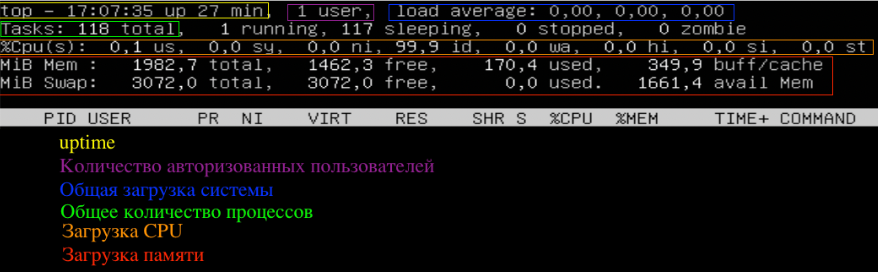 

* Для того, чтобы узнать pid процесса, занимающего больше всего памяти выполним запуск "top" с сортировкой по проценту занятой памяти `top -b -o +%MEM | head -n 22` необходимый процесс будет первым в списке (в данном случае PID процесса - 632) 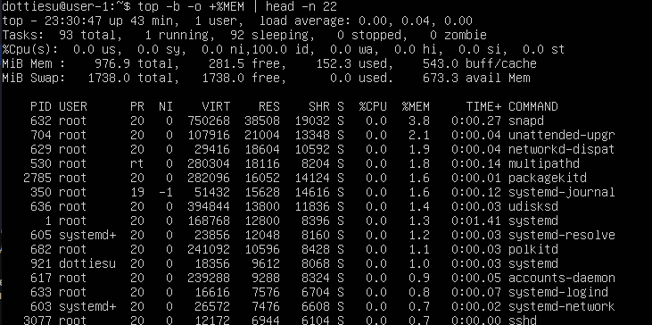 *pid процесса занимающего больше всего памяти* 

- По аналогии с предыдущим пунктом узнаем pid процесса, занимающего больше всего процессорного времени `top -b -o +TIME | head -n 22` (в данном случае PID - 1) 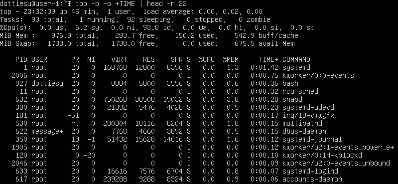

**htop:** 

* Запускаем утилиту командой `htop`, для изменения типа сортировку используем `F6` 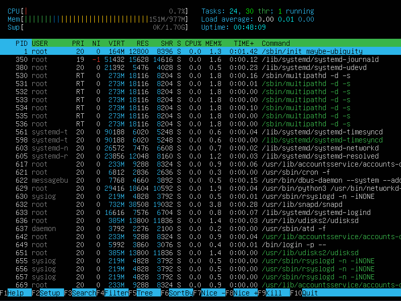 *PID*

* 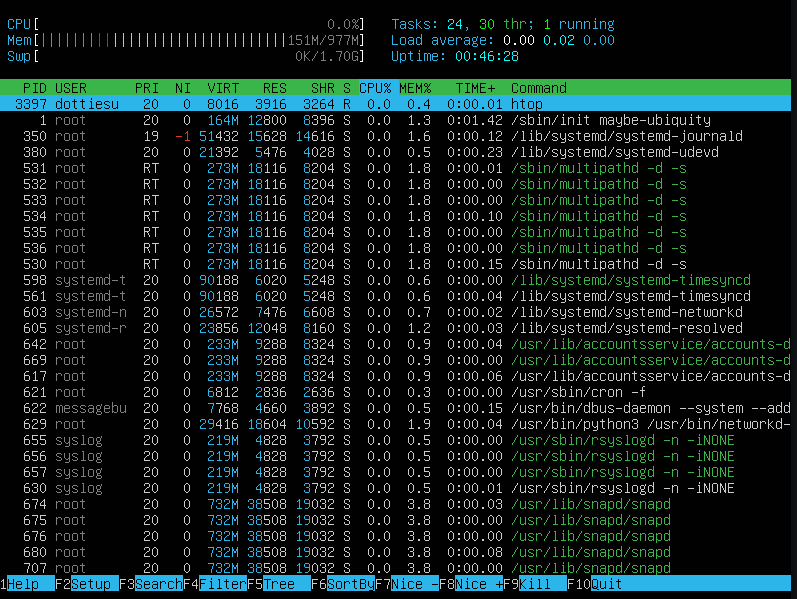 *PERCENT_CPU*
* 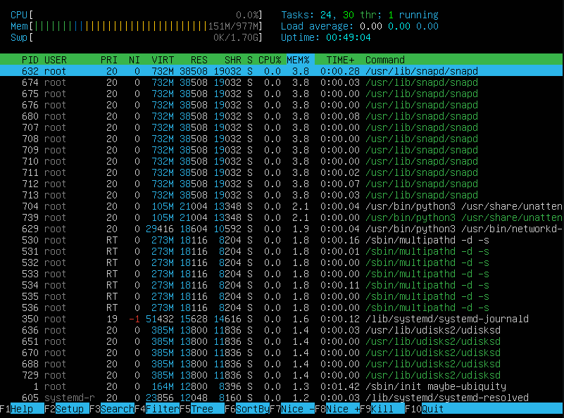 *PERCENT_MEM*

* 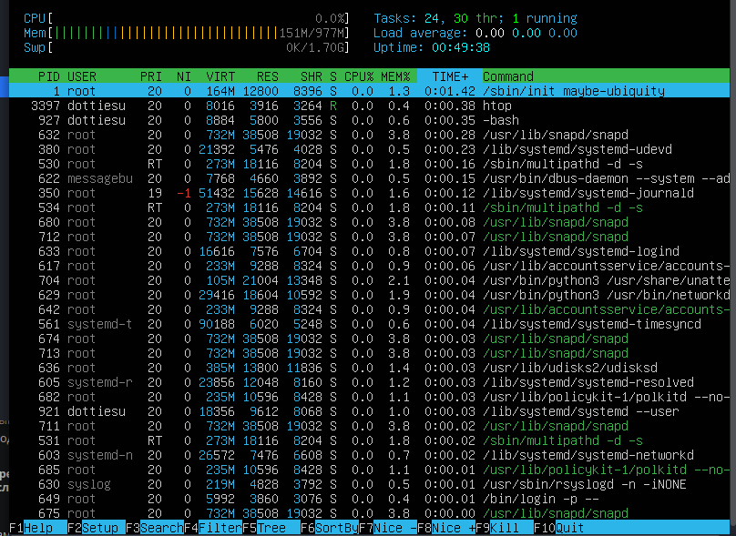 *TIME*
* Для фильтрации процессов по названию используем комбинацию клавиш `fn+F4` пишем необходимое название в данном случае  "sshd" 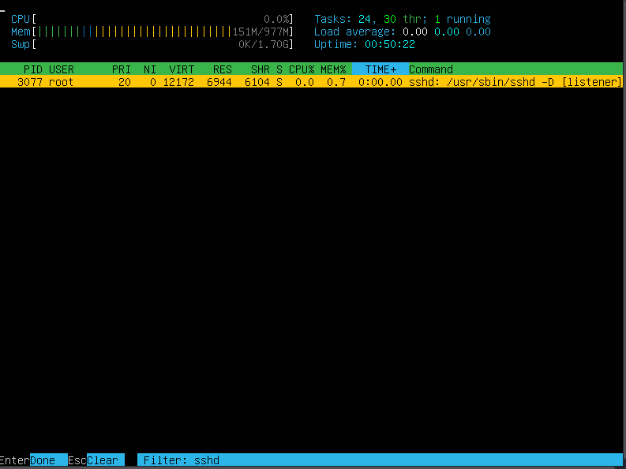 *SSHd*
* Для поиска процесса `syslog` используем функцию поиска процессов `fn+F3` 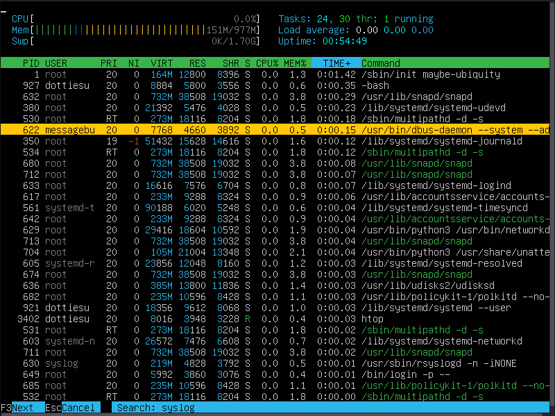 *syslog*

## Part 10. Использование утилиты **fdisk**

- Запускаем утилиту командой `sudo fdisk -l` 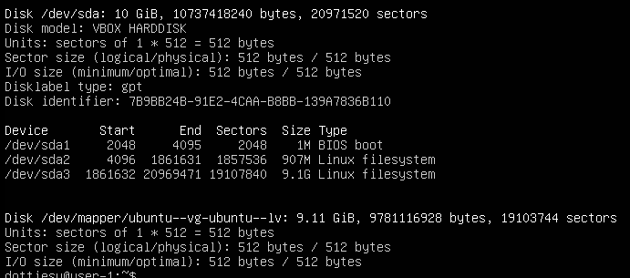

* *Информация о жестком диске* 
    * Название жесткого диска: VBOX HARDDISK 
    * Размер: 10 GiB 
    * Количество секторов: 20971520 
    * Размер swap: 1.70GiB

## Part 11. Использование утилиты **df**

- Запускаем команду `df` либо `df /`, для сортировки по корневому разделу 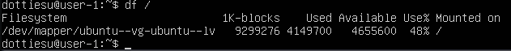

- *df корневой раздел* 
    * Размер раздела: 9299276 
    * Размер занятого пространства: 4149700 
    * Размер свободного пространства: 4655600 
    * Процент использования: 48% 
    * Единица измерения в выводе: Кб 

* Запускаем команду `df -Th` либо `df -Th /`, для сортировки по корневому разделу 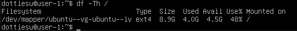 *df -Th корневой раздел* 

  * Размер раздела: 8.9G 
  * Размер занятого пространства: 4G 
  * Размер свободного пространства: 4.5G 
  * Процент использования: 48% 
  * Тип файловой системы для раздела: ext4 

## Part 12. Использование утилиты **du**

* Запускаем команду `du` 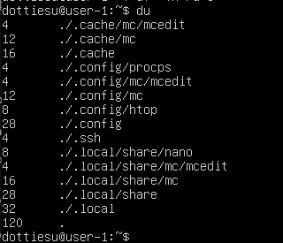 *Вывод команды du*

* Выводим размер папок в байтах `/home`, `/var`, `/var/log` с помощью команды `sudo du -s -h -b /home && sudo du -s -h -b /var && sudo du -s -h -b /var/log` 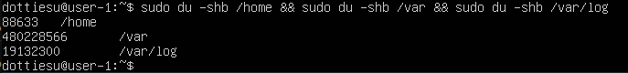 *Размер папок в байтах*

- Выводим размер всего содержимого в `/var/log` с помощью команды `sudo du -a -h /var/log` 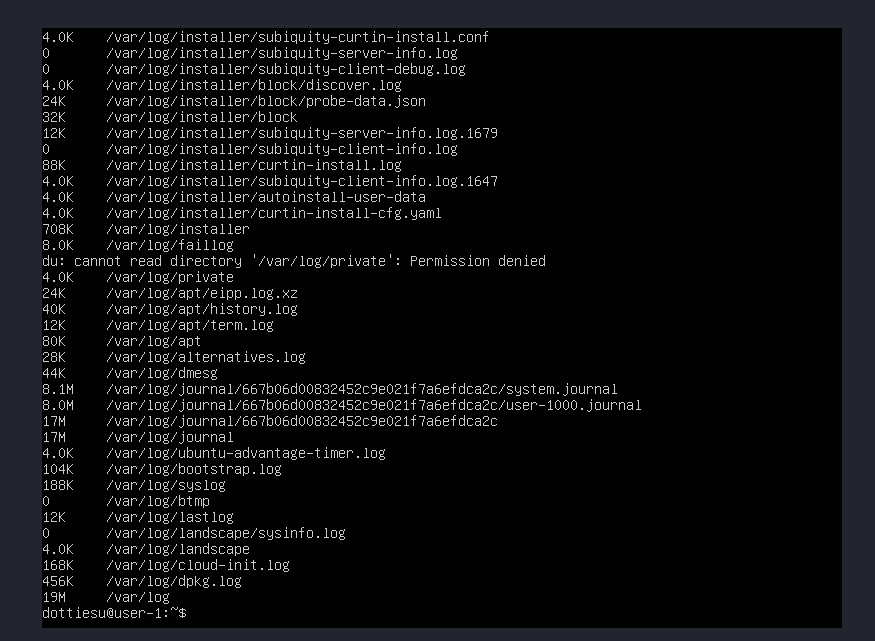

  

## Part 13. Установка и использование утилиты **ncdu**

* Устанавливаем утилиту **ncdu** командой `sudo apt install ncdu` 
* Выводим размер необходимых папок используя команду `ncdu`: 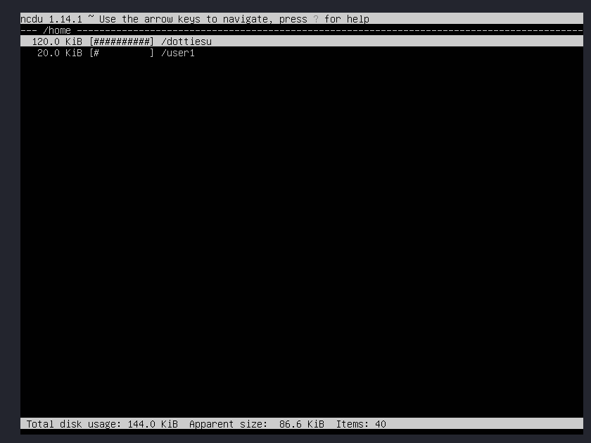  *ncdu /home*

* 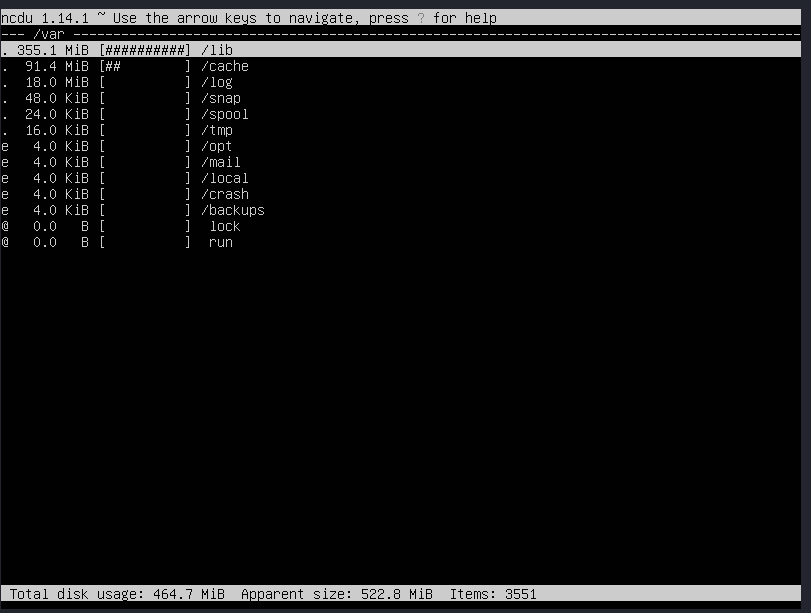 ncdu /var

* 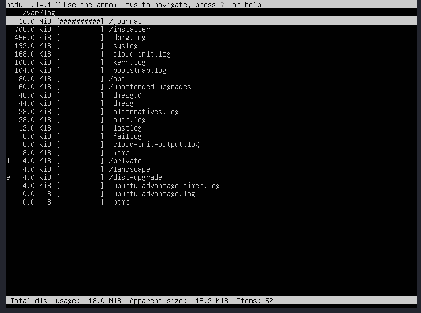 *ncdu /var/log*

## Part 14. Работа с системными журналами

* Открываем для просмотра системные журналы: 
* 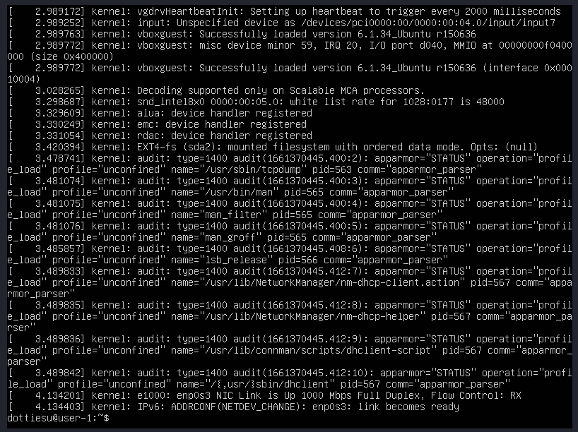 *cat /var/log/dmesg*

* 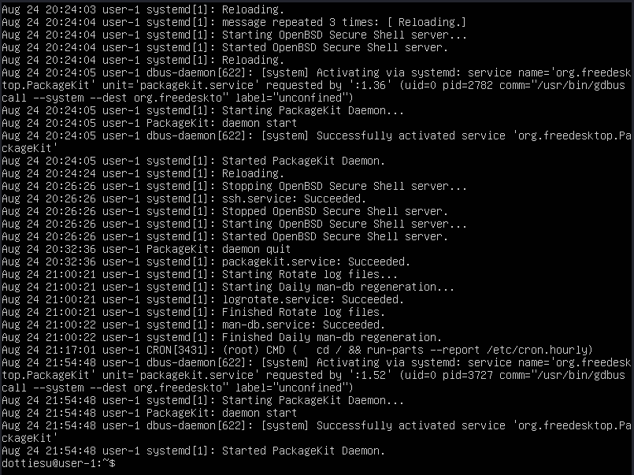 *cat /var/log/syslog*

* 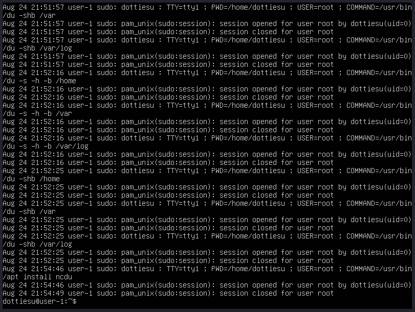 *cat /var/log/auth.log*

* Для того чтобы узнать время последней успешной авторизации используем команду `last` 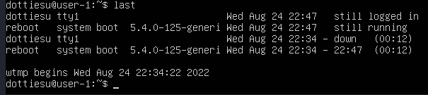 *Время последней успешной авторизации*

* перезапускаем службу SSHd и проверяем и ищем в логах сообщение о рестарте службы командами `sudo systemctl restart ssh` и `cat /var/log/syslog` 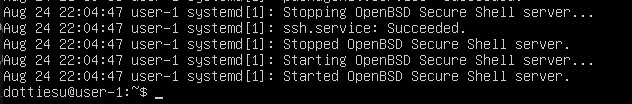 *Перезапуск SSHd в логах*

## Part 15. Использование планировщика заданий **CRON**

* Настраиваем cron для работы в фоновом режиме `sudo systemctl enable cron` 
* Для того, чтобы запланировать задачу используем команду `crontab -e`, затем выбираем один из предложенных текстовых редакторов 
* В открывшемся файле дописываем необходимую задачу (в нашем случае `"*/2 * * * * uptime"`), сохрняем и закрываем редактор, в терминале отобразится соощение об успешном добавлении задачи 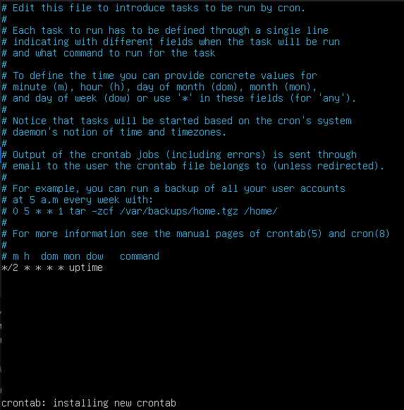

* Проверяем список текущих задач командой `crontab -l` 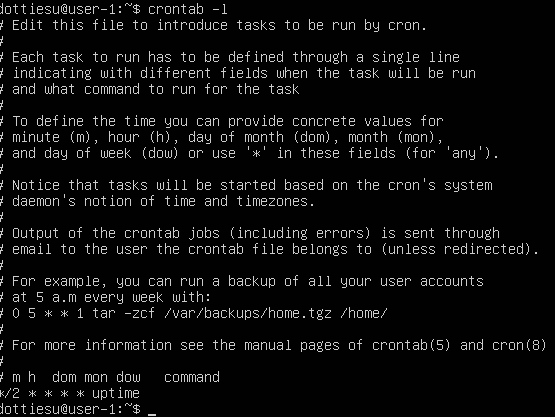 *список текущих задач*

* Проверяем выполение задач в логах командой `grep CRON /var/log/syslog` 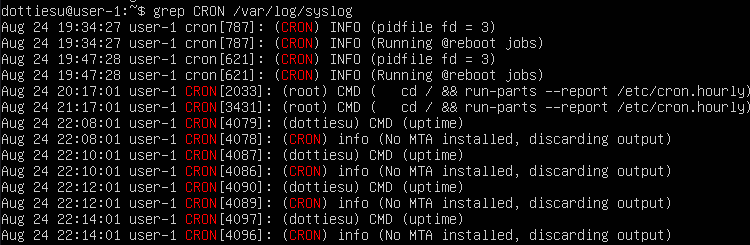 *Задача uptime в логах*

* Для удаления всех задач из планировщика используем команду `crontab -r` 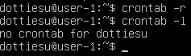 *Задачи отсутсвуют*
