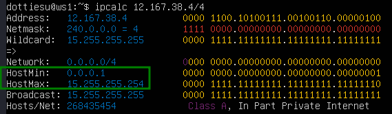

## Part 1. Инструмент **ipcalc**
1.1. Сети и маски

1.1.1. Адрес сети 192.167.38.54/13
  
1.1.2.1. Перевод маски 255.255.255.0 в префиксную и двоичную запись
  
1.1.2.2. Перевод маски /15 в обычную и двоичную запись
  
1.1.2.3. Перевод маски 11111111.11111111.11111111.11110000 в обычную и префиксную запись запись  
  
1.1.3. Минимальный и максимальный хост в сети 12.167.38.4 при маска: 

- /8    
- 11111111.11111111.00000000.00000000    
-  255.255.254.0   
-  /4   

1.2. localhost

Для localhost зарезервирован диапазон ip 127.0.0.1 по 127.255.255.254. Поэтому обратиться к приложению, работающем на localhost с IP 194.34.23.100 и 128.0.0.1 не сможем, тогда как к IP 127.0.0.2 и 127.1.0.1 можем.

1.3. Диапазоны и сегменты сетей

10.0.0.45/8 - private 
134.43.0.2/16 - public 
192.168.4.2/16 - private 
172.20.250.4/12 - private 
172.0.2.1/12 - public 
192.172.0.1/12 - semi private 
172.68.0.2/12 - public 
172.16.255.255/12 - private 
10.10.10.10/8 - private 
192.169.168.1/16- public 

2)Шлюзы, возможные у сети 10.10.0.0/18 
        - 10.10.0.2 
        - 10.10.10.10 
        - 10.10.1.255 

## Part 2. Статическая маршрутизация между двумя машинами

С помощью команды ip a посмотреть существующие сетевые интерфейсы

2.0.1. Вывод команды `ip a` для машины ws1 

2.0.2. Вывод команды `ip a` для машины ws2 

2.0.3. Установка для машины ws1 адреса 192.168.100.10/16 

2.0.4. Установка для машины ws2 адреса 172.24.116.8/120 

2.0.5. Выполнение команды natplan apply для машины ws1 

2.0.6. Выполнение команды natplan apply для машины ws2 

2.1. Добавление статического маршрута вручную 

2.1.1. Добавление статического маршрута от машины ws1 к ws2. 

2.2. Добавление статического маршрута с сохранением

2.2.1. Добавление статического маршрутка от машины ws1 к ws2 после перезапуска 

2.2.2. Добавление статического маршрутка от машины ws2 к ws1 после перезапуска 

2.2.3. Принятие изменений 
 

2.2.4. Вывод результата пингования 

## Part 3. Утилита **iperf3**

3.1. Скорость соединения

- 8 Mpbs = 1 MB/s
- 100 MB/s = 819200 Kbps
- 1 Gbps = 1000 Mbps

3.2. Устанавливаем ws1 как сервер при помощи команды `iperf3 -s` с последующим измерением скорости соединения, на ws2 командой `iperf3 -c 192.168.100.10 -p 5201` измерением скорость соединения  

## Part 4. Сетевой экран

4.1. Утилита **iptables**

1 Файл firewall.sh с содержимым для машины ws1 и ws2 
2 результаты команды `ping` 
 4.2. Утилита **nmap** 

## Part 5. Статическая маршрутизация сети
* *ws11 & ws21 & ws22 etc/netplan/00-installer-config.yaml*  
* *r1 & r2 etc/netplan/00-installer-config.yaml* 
* ws11 ip -4 a  ping r1 
* ws21 ip -4 a output and ping ws22 and r2 
* ws22 `ip -4 a` and ping `ws21`  
* *r1 ip -4 a* 
* *r2 ip -4 a* 

#### 5.2. Включение переадресации IP-адресов.

* *`sysctl -w net.ipv4.ip_forward=1` output for r1 & r2* 

* *r1 & r2 /etc/sysctl.conf file* 

#### 5.3. Установка маршрута по-умолчанию

* *gateway for ws11 & ws21 & ws22 *

* *tcpdump command output* 

* ws11 & ws21 & ws22  ip r command output  

#### 5.4. Добавление статических маршрутов

* *etc/netplan/00-installer-config.yaml* 

* *ip r command output* 

#### 5.5. Построение списка маршрутизаторов

* *traceroute 10.20.0.10 command output *
* *tcpdump -tnv -i enp0s8 command output* 

 Принцип работы traceroute

Для определения промежуточных маршрутизаторов traceroute отправляет серию пакетов данных целевому узлу, при этом каждый раз увеличивая на 1 значение поля TTL («время жизни»). Это поле обычно указывает максимальное количество маршрутизаторов, которое может быть пройдено пакетом. Первый пакет отправляется с TTL, равным 1, и поэтому первый же маршрутизатор возвращает обратно сообщение ICMP, указывающее на невозможность доставки данных. Traceroute фиксирует адрес маршрутизатора, а также время между отправкой пакета и получением ответа (эти сведения выводятся на монитор компьютера). Затем traceroute повторяет отправку пакета, но уже с TTL, равным 2, что позволяет первому маршрутизатору пропустить пакет дальше.

Процесс повторяется до тех пор, пока при определённом значении TTL пакет не достигнет целевого узла. При получении ответа от этого узла процесс трассировки считается завершённым.

#### 5.6. Использование протокола **ICMP** при маршрутизации

* *ping -c 1 10.30.0.111 command output* 
* *traceroute -n -i enp0s8 command outputetc *
## Part 6. Динамическая насdhcтройка IP с помощью **DHCP**

* r2 dhcp.conf re

* r2 resolv.conf 

- r1 dhcp.conf  

- r1 resolve.conf 

- r1 r2 systemctl status isc-dhcp-server 

- ws11 `ip -4 a` 

- ws21 `ip -4 a` `ping` 

- ws21 обновление ip 

## Part 7. **NAT**

- В файле */etc/apache2/ports.conf* на ws22 и r1 изменить строку `Listen 80` на `Listen 0.0.0.0:80`, то есть сделать сервер Apache2 общедоступным 
- Запустить веб-сервер Apache командой `service apache2 start` на ws22 и r1 
- Добавить в фаервол, созданный по аналогии с фаерволом из Части 4, на r2 следующие правила:
   
   
- Разрешить маршрутизацию всех пакетов протокола **ICMP** 
   
- Включить **SNAT**, а именно маскирование всех локальных ip из локальной сети, находящейся за r2 (по обозначениям из Части 5 - сеть 10.20.0.0) Включить **DNAT** на 8080 порт машины r2 и добавить к веб-серверу Apache, запущенному на ws22, доступ извне сети В отчёт поместить скрин с содержанием изменённого файла.
  

- Проверить соединение по TCP для **SNAT**, для этого с ws22 подключиться к серверу Apache на r1 командой: `telnet [адрес] [порт]` Проверить соединение по TCP для **DNAT**, для этого с r1 подключиться к серверу Apache на ws22 командой `telnet` (обращаться по адресу r2 и порту 8080) *Перед тестированием рекомендуется отключить сетевой интерфейс **NAT** (его наличие можно проверить командой `ip a`) в VirtualBox, если он включен* Запускать файл также, как в Части 4 В отчёт поместить скрины с вызовом и выводом использованных команд.
   

## Part 8. Дополнительно. Знакомство с **SSH Tunnels**

- Запустить веб-сервер **Apache** на ws22 только на localhost (то есть в файле */etc/apache2/ports.conf* изменить строку `Listen 80` на `Listen localhost:80`)  
- 
- Воспользоваться *Local TCP forwarding* с ws21 до ws22, чтобы получить доступ к веб-серверу на ws22 с ws21  
- Воспользоваться *Remote TCP forwarding* c ws11 до ws22, чтобы получить доступ к веб-серверу на ws22 с ws11 
- ws11: `telnet 127.0.0.1 80 `
   `
