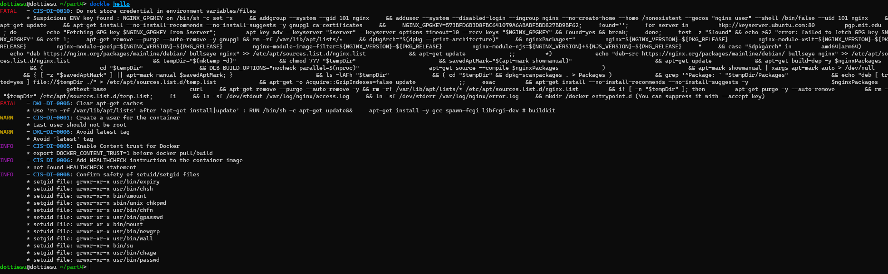

### Part 1. Готовый докер
- Взять официальный докер образ с nginx и выкачать его при помощи docker pull nginx Image
- Проверил наличие докер образа через docker images
- Запустил докер образ через ``docker run -d [image_id|repository]``
- Проверил, что образ запустился через docker ps

- Просмотр информации о контейнере при помощи команды docker inspect container_id 
- размер контейнера   
- список замапленных портов   
- ip контейнера  
- Остановить докер образ через docker stop [container_id|container_name]  Проверить, что образ остановился через docker ps

- Запустить докер с портами 80 и 443 на локальную машину через команду run 
 
- Перезапуск докера и проверка, что он запустился 
---
### Part 2. Операции с контейнером
- Прочитать конфигурационный файл nginx.conf внутри докер контейнера через команду exec 
- Создать на локальной машине файл nginx.conf
 
- Скопировать созданный файл nginx.conf внутрь докер образа через команду docker cp и проверить, что по адресу localhost:80/status отдается страничка со статусом сервера nginx 
- Экспортировать контейнер в файл container.tar через команду export. 
- Удалить образ через docker rmi [image_id|repository], не удаляя перед этим контейнеры 
- Удалить остановленный контейнер 
- Импорт контейнера обратно. Запуск импортированного контейнера.  
- Проверка работоспособности контейнера. 
---
### Part 3. Мини веб-сервер
- Мини сервер на C и FastCgi, который будет возвращать Hello World! 
- Создание nginx.conf 
- Выкачка докера nginx. Проверка, что загрузка прошла успешно.Запуск образа и проверка, что он запустился  
- Копирование nginx.conf и hello.c в докер-контейнер 
- Обновление контейнера. Установка gcc, spawn-dcgi, libfcgi-dev 
- Компиляция и запуск сервера  
- Перезагрузка nginx и проверка страницы в браузере 
---
### Part 4. Свой докер
- Создание докер образа 
- Сбор написанного образа. Маппинг 81 порта на 80. 
- Проверка на корректность 
---
### Part 5. Dockle
- Сканирование образа 
- Проверка на отсутствие ошибок и предупреждений после исправления образа 
---
### Part 6. Базовый Docker Compose
- Файл docker-compose.yml 
- Создадим Dockerfile для proxy. 
- Собираем и запускаем проект 

