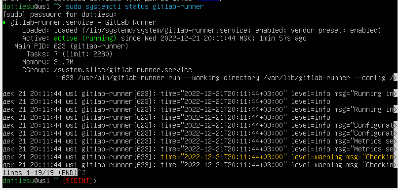
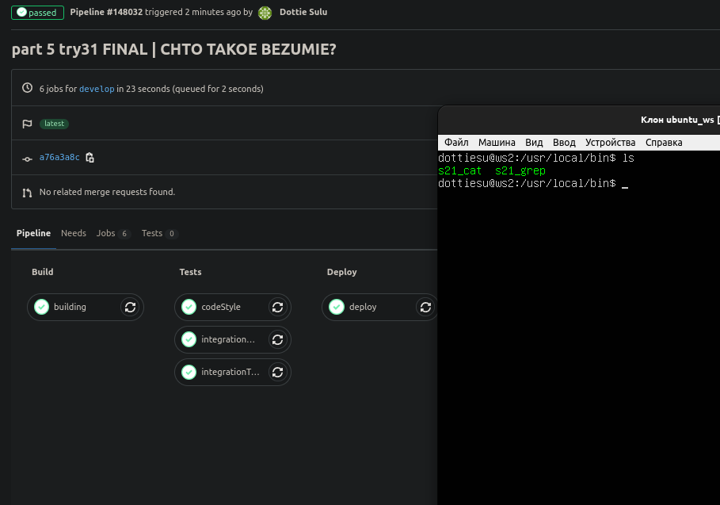
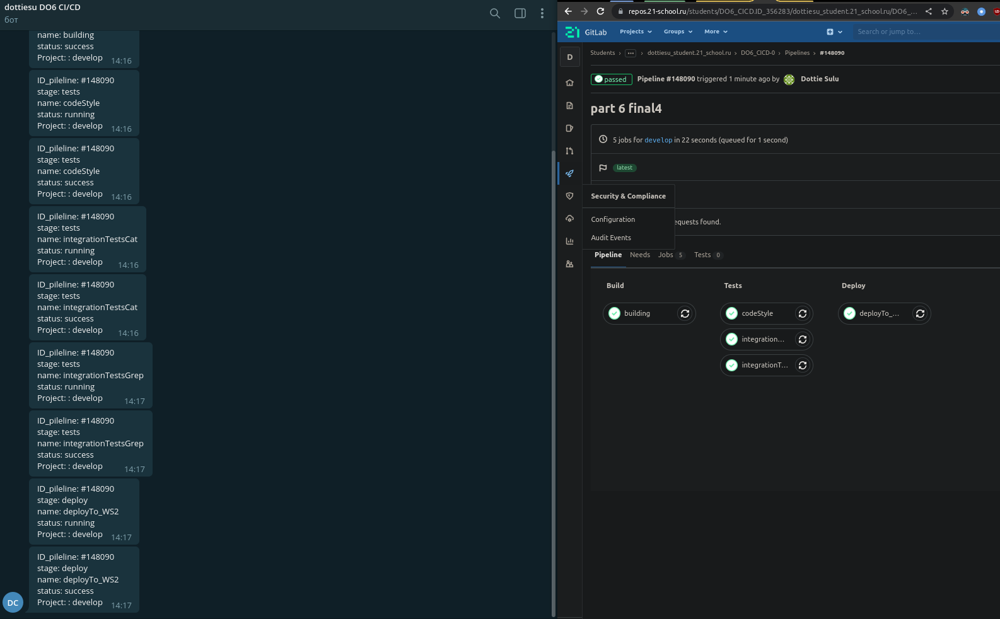

### Part 01
- Проверка работы после установки на виртуальную машину
  
https://repos.21-school.ru/students/DO6_CICD.ID_356283/dottiesu_student.21_school.ru/DO6_CICD-0/-/jobs/341512

### Part 02
- Написать этап для CI по сборке приложений из проекта C2_SimpleBashScripts:
- .gitlab-ci.yml по ссылке https://repos.21-school.ru/students/DO6_CICD.ID_356283/dottiesu_student.21_school.ru/DO6_CICD-0/-/blob/d953a2667352c4b1dce7e5ba395be6fb49648482/.gitlab-ci.yml
- https://repos.21-school.ru/students/DO6_CICD.ID_356283/dottiesu_student.21_school.ru/DO6_CICD-0/-/jobs/341516
- Артефакты по ссылке https://repos.21-school.ru/students/DO6_CICD.ID_356283/dottiesu_student.21_school.ru/DO6_CICD-0/-/jobs/341516/artifacts/download

### Part 03
- ссылка на .gitlab-ci.yml https://repos.21-school.ru/students/DO6_CICD.ID_356283/dottiesu_student.21_school.ru/DO6_CICD-0/-/blob/3e71647e6a3ad3da84d8b6b31ae18ce1b4e2eb98/.gitlab-ci.yml
- результат сборки https://repos.21-school.ru/students/DO6_CICD.ID_356283/dottiesu_student.21_school.ru/DO6_CICD-0/-/pipelines/147802

### Part 04
failed: Заваленные тесты у grep
https://repos.21-school.ru/students/DO6_CICD.ID_356283/dottiesu_student.21_school.ru/DO6_CICD-0/-/pipelines/147859

passed: Все тесты прошли
https://repos.21-school.ru/students/DO6_CICD.ID_356283/dottiesu_student.21_school.ru/DO6_CICD-0/-/pipelines/147868

### Part 05
- Добваленный этап деплоя в .gitlab-ci.yml по ссылке https://repos.21-school.ru/students/DO6_CICD.ID_356283/dottiesu_student.21_school.ru/DO6_CICD-0/-/blob/a76a3a8c832de5004f89c7a8d4454186aba07149/.gitlab-ci.yml
  
https://repos.21-school.ru/students/DO6_CICD.ID_356283/dottiesu_student.21_school.ru/DO6_CICD-0/-/pipelines/148032

### Part 06
  
https://repos.21-school.ru/students/DO6_CICD.ID_356283/dottiesu_student.21_school.ru/DO6_CICD-0/-/pipelines/148090
